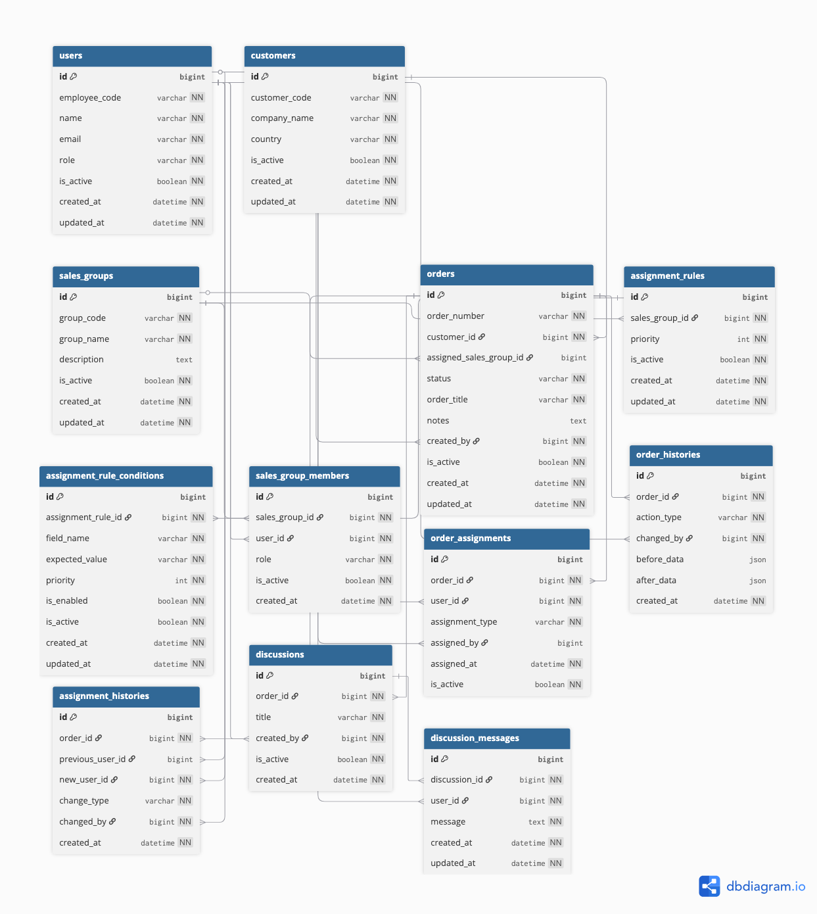

# Assignment System

企業の問い合わせ・受注内容に応じて、
適切な営業グループ・担当者へ案件を振り分ける業務支援システム。

単純な担当割り当てではなく、
業務変更や組織変更へ柔軟に対応できる構成を目指して設計・開発を進めています。

---

## Overview

営業組織では、案件内容に応じた担当振り分けが属人化しやすく、
条件変更時の運用負荷が高くなるケースがあります。

本システムでは、振り分け条件をDB管理することで、

* 変更容易性
* 運用性
* 拡張性

の向上を目指しています。

また、単純なCRUDシステムではなく、
実際の業務フローを意識した設計を重視しています。

想定業務フロー：

1. 受注登録
2. 営業グループ振り分け
3. 担当者アサイン
4. ディスカッション
5. 履歴管理

---

## Design Concept

### Rule-Based Assignment

振り分け条件をDB管理。

* 条件追加
* 優先度変更
* 組織変更

へ柔軟に対応可能な構成を目指しています。

関連テーブル：

* `assignment_rules`
* `assignment_rule_conditions`

---

### Business Flow Oriented Design

実際の業務フローを意識して設計。

単なるデータ管理ではなく、

* 担当振り分け
* 履歴追跡
* コミュニケーション

を業務単位で扱える構成を目指しています。

---

### Auditability

履歴管理を重視。

以下テーブルで変更履歴を管理：

* `order_histories`
* `assignment_histories`

将来的な監査性・トレーサビリティを考慮しています。

---

### Discussion Support

受注単位でコミュニケーション可能な構成。

関連テーブル：

* `discussions`
* `discussion_messages`

業務上のやり取りを記録可能にすることで、
情報共有・引き継ぎを行いやすくすることを目的としています。

---

## Main Features

* 受注登録 API
* ルールベース営業グループ振り分け
* 自動担当者アサイン
* 担当者再割当
* ステータス更新
* 履歴管理
* ディスカッション機能

---

## Tech Stack

* Next.js App Router — API / Frontend
* TypeScript — Type Safety
* Prisma — ORM / Migration
* SQLite — Local Development Database
* Git / GitHub — Version Control

---

## ER Diagram

受注・営業グループ・振り分けルール・履歴管理を中心に設計。



---

## Database Design

主なテーブル構成：

### Basic

* `users`
* `sales_groups`
* `customers`
* `orders`

### Assignment Rules

* `assignment_rules`
* `assignment_rule_conditions`

### Relations

* `sales_group_members`
* `order_assignments`

### Histories

* `order_histories`
* `assignment_histories`

### Discussions

* `discussions`
* `discussion_messages`

---

## Prisma / Database

以下を実装済み：

* Prisma schema
* Prisma migrate
* Prisma Client
* seed data
* Prisma Studio

---

## Current Status

### Completed

* ER設計
* Prisma schema
* migration
* seed
* relation設計
* unique制約整理
* Prisma Studio確認
* API実装
* 自動営業グループ振り分け
* 自動担当者アサイン
* ステータス更新
* 担当者再割当
* ディスカッション機能
* 履歴管理
* transaction対応

### In Progress

* バリデーション強化
* API拡張
* 振り分け条件ロジック改善
* UI設計

### Planned

* 認証機能
* UI実装
* バリデーション
* 通知機能
* 権限制御
* PostgreSQL対応
* APIテスト強化

---

## Development Environment

```bash id="t97c7l"
npm install
npx prisma migrate dev
npm run dev
```

---

## Notes

本プロジェクトは、
業務システムにおける「変更に強い設計」を意識して開発中。

特に以下を重視しています。

* DB中心設計
* 変更容易性
* 履歴管理
* 業務フロー整合性
* 将来的な拡張性

また、振り分け条件をコードへ固定化せず、
DB管理することで運用変更時の改修コスト低減を目指しています。:::
